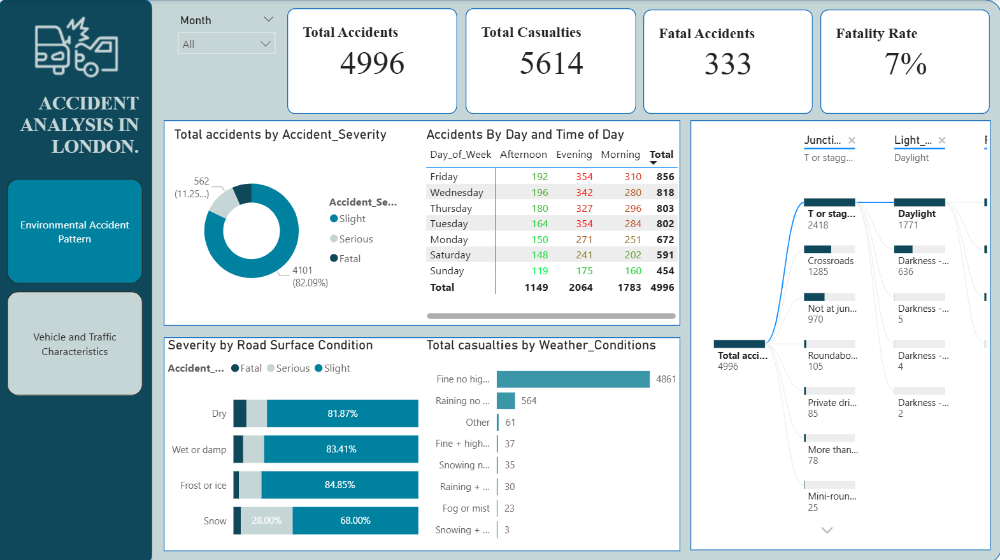
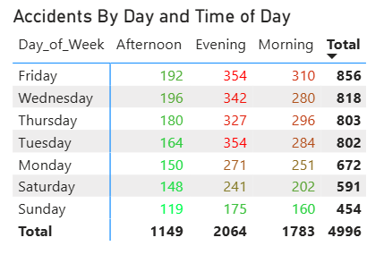
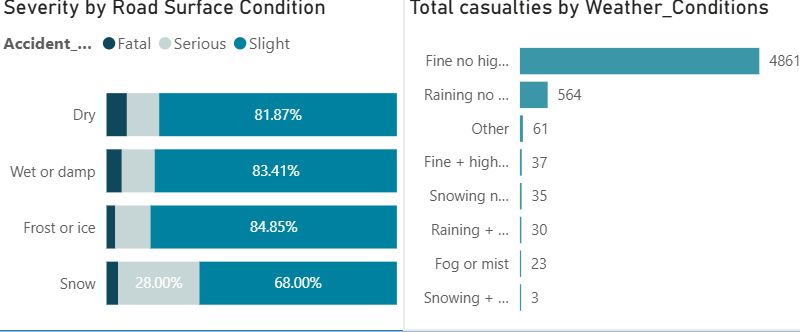
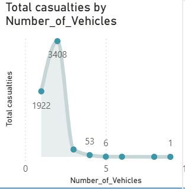

# 🚦 Road Accident Data Analysis Dashboard

## 📖 Overview

This project analyzes road accident data using Power BI to uncover patterns, identify high-risk factors, and provide data-driven insights that can improve road safety and support informed decision-making.

The dashboard transforms raw accident data into interactive visualizations that explore when, where, and why road accidents occur, highlighting trends related to accident severity, casualties, road conditions, environmental factors, and vehicle involvement.

## ❗ Problem Statement

Road accidents remain a major cause of injuries, fatalities, and property damage. However, many road safety decisions are made without sufficient data-driven insights.

Key challenges include:

- Limited visibility into high-risk accident locations.
- Poor understanding of factors contributing to severe accidents.
- Lack of insight into accident trends across time.
- Difficulty identifying dangerous road types, speed limits, and junctions.
- Insufficient evidence to support effective road safety policies and interventions.

Without comprehensive data analysis, authorities and stakeholders face challenges in:

- Reducing accident severity.
- Improving traffic management.
- Designing safer road infrastructure.
- Enhancing emergency response planning.
- Protecting road users.

## 🎯 Objectives

### Main Objective

To analyze road accident data using Power BI and generate actionable insights that support road safety, accident prevention, and informed decision-making.

### Specific Objectives

- Identify high-risk periods for road accidents.
- Determine locations and districts with the highest accident rates.
- Analyze factors influencing accident severity.
- Examine the relationship between speed limits and casualties.
- Investigate how road types affect accident occurrence.
- Understand the impact of environmental conditions on accidents.
- Compare accident patterns in urban and rural areas.
- Identify vehicle types most frequently involved in accidents.
- Support data-driven road safety planning through interactive dashboards.

## 📊 Dataset Description

The dataset contains detailed records of road accidents, including:

- Date and time of accidents
- Day of the week
- Latitude and longitude
- District and location
- Road type
- Road surface conditions
- Weather conditions
- Light conditions
- Speed limits
- Junction types and controls
- Urban or rural classification
- Vehicle types
- Number of vehicles involved
- Number of casualties
- Accident severity

## 🛠 Tools Used

- Power BI
- Power Query
- DAX
- Microsoft Excel (Data Preparation)

## 🧹 Data Preparation

Before creating the dashboard, the dataset was prepared by:

- Cleaning missing and inconsistent values.
- Correcting data types.
- Creating calculated columns and measures using DAX.
- Formatting date and time fields.
- Organizing data for efficient visualization.

## 📈 Dashboard Analysis

The dashboard answers the following business questions:

1. When do road accidents occur most frequently?
2. Which districts and locations record the highest number of accidents?
3. Which factors contribute to the most severe accidents?
4. Which speed limits are associated with the highest number of casualties?
5. Do urban or rural areas experience more severe accidents?
6. Which road types are the most dangerous?
7. Which junction types and traffic controls have the highest accident rates?
8. Which vehicle types are most commonly involved in accidents?
9. Do accidents involving more vehicles result in more casualties?
10. Which environmental conditions increase accident risk the most?

## 📊 Dashboard Features

The dashboard includes interactive visualizations such as:

- KPI Cards
- Line Charts
- Bar and Column Charts
- Pie and Donut Charts
- Maps
- Scatter Plots
- Slicers and Filters

Users can filter results by:

- Year
- District
- Weather
- Road Type
- Speed Limit
- Vehicle Type
- Urban/Rural Area
- Accident Severity

## 📸 Dashboard Preview

### Main Dashboard

### Accident Trends

### Road Conditions Analysis

### Casualty Analysis

## 💡 Key Insights

The dashboard enables users to:

- Identify accident hotspots.
- Recognize peak accident periods.
- Understand how environmental conditions affect accident frequency.
- Analyze the relationship between speed limits and casualties.
- Compare accident severity across different road types and locations.
- Evaluate vehicle involvement in road accidents.

## 🚀 Future Improvements

Potential enhancements for this project include:

- Integrating live accident data.
- Developing predictive models for accident severity.
- Creating geospatial hotspot analysis using advanced mapping tools.
- Building automated reports with Power BI Service.
- Incorporating demographic and traffic volume data for deeper analysis.

## 👨‍💻 Author

Elvis Odili-Ossai

This project was developed as part of my data analytics portfolio to demonstrate proficiency in Power BI, data visualization, dashboard design, and business intelligence using real-world road accident data.

## 📄 License

This project is intended for educational and portfolio purposes.
